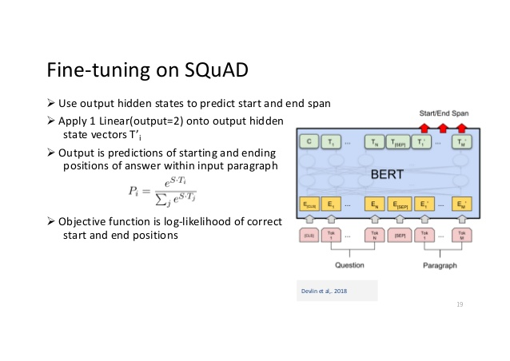

# 阅读理解

### 模型简介

阅读理解(Machine Reading Comprehension)被誉为人工智能皇冠上的明珠，是自然语言处理领域最具有挑战的任务之一。如下图所示，阅读理解任务可以被定义为：

给定若干篇章（一个或者多个）以及若干问题，机器需要在理解整个篇章的基础上，给出正确的答案，答案不限类型，可以是一个数字，一个实体名称，也可以是一个段落。


从实现方式上来看，阅读理解模型可以分为**抽取式模型**和**生成式模型**；这个项目里包涵了基于[BERT](https://arxiv.org/abs/1810.04805) 的抽取式阅读理解模型，原理如下图所示。



我们把给定的问题和篇章拼成一个文本，并输入到BERT里，经过多层transformer编码后，我们使用softmax op，去预测答案在篇章中的**起始位置(start position)**和**结束位置(end position)**，这两个位置之间的文本就可以被认为是答案片段。

## 快速开始
- [**安装**](#安装)
- [**数据下载**](#数据下载)
- [**模型下载**](#模型下载)
- [**训练**](#训练)
- [**预测**](#预测)
- [**评估**](#评估)
- [**模型部署**: 多硬件环境模型部署支持](#模型部署)
  - [产出用于部署的 inference model](#保存-inference-model)
  - [inference 接口调用示例](#inference-接口调用示例)
  
- [**数据格式说明&使用自定义数据**](#数据格式说明)
- [**贡献代码**](#贡献代码)

## 安装

本项目依赖于 Paddle Fluid **1.4.1**，请参考[安装指南](http://www.paddlepaddle.org/#quick-start)进行安装。

## 数据下载

本项目内自带[Squad](https://rajpurkar.github.io/SQuAD-explorer/) v1.1 和 v2.0 两个任务的训练(training)和验证(dev)数据，在./data/input目录下。用户可以自行下载数据至./data/input目录下。

## 模型下载

使用本项目需要下载BERT的预训练模型，用户可以通过PaddlePaddle的自然语言预训练工具箱[**LARK**](https://github.com/PaddlePaddle/LARK/tree/develop/BERT)获取丰富的预训练模型进行模型开发和优化，本项目默认使用LARK下的[Cased BERT-Large](https://bert-models.bj.bcebos.com/cased_L-24_H-1024_A-16.tar.gz)模型。请下载并存放到./data/pretrain_models目录下。

## 训练

我们可以通过main.py脚本完成整个模型的训练，预测，评估和线上部署等流程，在run.sh中，我们给出了使用样例。结合run.sh脚本，我们详细说明一下整个模型的使用方法。首先，在运行之前，我们需要先设置一下环境变量：

```shell
#引入本地环境变量
source ~/.bash_profile
#打开Fluid的显存优化功能
export FLAGS_eager_delete_tensor_gb=0.0
#设置需要使用的GPU资源，如果想要单卡运行，则设置：
#	export CUDA_VISIBLE_DEVICES=0
#如果想要使用CPU运行，则设置：
# export CUDA_VISIBLE_DEVICES=""
export CUDA_VISIBLE_DEVICES=1,5,7
```

在设置好环境变量后，我们可以使用以下命令开始训练过程：

```shell
fluid -u main.py \
    --do_train=True \
    --learning_rate 3e-5 \
    --use_cuda=True
```

注意，模型在运行过程中需要的超参数都定义在arg_config.py内，在运行过程中，如果需要修改超参数，可以通过命令行的方式指定，例如，如果希望修改训练过程中的warmup_proportion = 0.2，则可以通过以下命令完成：

```shell
fluid -u main.py \
    --do_train=True \
    --learning_rate 3e-5 \
    --use_cuda=True \
    --warmup_proportion=0.2
```

用户也可以自定义其他超参，详见arg_config.py。

## 混合精度训练

预训练过程和 Fine-tuning 均支持 FP16/FP32 混合精度训练。要使能混合精度训练，只需在前面所述的这些训练启动命令中加入参数

```
--use_fp16=true \
```

为了减少混合精度训练的精度损失，通常在训练过程中计算误差的反向传播时，会将损失函数乘上一个大于 1.0 的因子，这里可以通过如下方式设置这个因子

```
--loss_scaling=8.0 \
```

实验表明，在 BERT 相关的任务中 `loss_scaling` 的取值范围在 8.0 ~ 128.0 之间时模型训练精度没有显著的损失，在 V100 GPU 上混合精度训练相对于 FP32 训练有 1.7 左右的加速比。

更多的细节，可参见[参考论文](https://arxiv.org/abs/1710.03740)。

## 预测

同样的，用户可以通过main.py进行预测，如下面的命令：

```shell
fluid -u main.py \
    --do_predict=True \
    --use_cuda=True
```

## 评估

在评估过程中，我们内嵌了squad官方的评估脚本，用户可以通过main.py进行自动化评估：

```shell
fluid -u main.py \
    --do_eval=True
```

在执行后，可以得到以下评估指标：

**{"f1": 92.75260448634734, "exact_match": 86.41438032166509}**

## 模型部署

深度学习模型需要应用于实际情景，则需要进行模型的部署，把训练好的模型部署到不同的机器上去，这需要考虑不同的硬件环境，包括 GPU/CPU 的环境，单机/分布式集群，或者嵌入式设备；同时还要考虑软件环境，比如部署的机器上是否都安装了对应的深度学习框架；还要考虑运行性能等。但是要求部署环境都安装整个框架会给部署带来不便，为了解决深度学习模型的部署，一种可行的方案是使得模型可以脱离框架运行，Paddle Fluid 采用这种方法进行部署，编译 [Paddle Fluid inference](http://paddlepaddle.org/documentation/docs/zh/1.2/advanced_usage/deploy/inference/build_and_install_lib_cn.html) 库，并且编写加载模型的 `C++` inference 接口。预测的时候则只要加载保存的预测网络结构和模型参数，就可以对输入数据进行预测，不再需要整个框架而只需要 Paddle Fluid inference 库，这带来了模型部署的灵活性。

以语句和语句对分类任务为例子，下面讲述如何进行模型部署。首先需要进行模型的训练，其次是要保存用于部署的模型。最后编写 `C++` inference 程序加载模型和参数进行预测。

前面 [语句和句对分类任务](#语句和句对分类任务) 一节中讲到了如何训练 XNLI 任务的模型，并且保存了 checkpoints。但是值得注意的是这些 checkpoint 中只是包含了模型参数以及对于训练过程中必要的状态信息（参见 [params](http://paddlepaddle.org/documentation/docs/zh/1.3/api_cn/io_cn.html#save-params) 和 [persistables](http://paddlepaddle.org/documentation/docs/zh/1.3/api_cn/io_cn.html#save-persistables) ), 现在要生成预测用的 [inference model](http://paddlepaddle.org/documentation/docs/zh/1.2/api_cn/io_cn.html#permalink-5-save_inference_model)，可以按照下面的步骤进行。

### 保存 inference model

```shell
fluid -u main.py \
    --do_save_inference=True \
    --use_cuda=True
```

以上的脚本会load一个已经训练好的模型（用户可以通过—init_params_from指定具体路径），并在./data/inference_model目录下，生成两个文件：

1. model.pdmodel，模型文件，记录了模型的结构。
2. params.pdparams，参数文件，记录了模型的参数值。

我们只需要这两文件，就可以使用C++语言进行模型的上线部署工作。

### inference 接口调用示例

使用 `C++` 进行预测的过程需要使用 Paddle Fluid inference 库，具体的使用例子参考 [`inference`](./inference) 目录下的 `README.md`.

下面的代码演示了如何使用 `C++` 进行预测，更多细节请见 [`inference`](./inference) 目录下的例子，可以参考例子写 inference。

``` cpp
#include <paddle_inference_api.h>

// create and set configuration
paddle::NativeConfig config;
config.model_dir = "xxx";
config.use_gpu = false;

// create predictor
auto predictor = CreatePaddlePredictor(config);

// create input tensors
paddle::PaddleTensor src_id;
src.dtype = paddle::PaddleDType::INT64;
src.shape = ...;
src.data.Reset(...);

paddle::PaddleTensor pos_id;
paddle::PaddleTensor segmeng_id;
paddle::PaddleTensor input_mask;

// create iutput tensors and run prediction
std::vector<paddle::PaddleTensor> output;
predictor->Run({src_id, pos_id, segmeng_id, input_mask}, &output);

// XNLI task for example
std::cout << "example_id\tcontradiction\tentailment\tneutral";
for (size_t i = 0; i < output.front().data.length() / sizeof(float); i += 3) {
  std::cout << static_cast<float *>(output.front().data.data())[i] << "\t"
            << static_cast<float *>(output.front().data.data())[i + 1] << "\t"
            << static_cast<float *>(output.front().data.data())[i + 2] << std::endl;
}
```


## 数据格式说明

本项目使用的数据默认均为json格式编码，训练数据和测试数据各放在一个json文件内。在每个json文件内，记录了若干段落以及对应的答案信息，样例如下：

```json
paragraphs:[
  context:"Super Bowl 50 was an American football game to determine the champion of the National Football League (NFL) for the 2015 season. The American Football Conference (AFC) champion Denver Broncos defeated the National Football Conference (NFC) champion Carolina Panthers 24–10 to earn their third Super Bowl title. The game was played on February 7, 2016, at Levi's Stadium in the San Francisco Bay Area at Santa Clara, California. As this was the 50th Super Bowl, the league emphasized the \"golden anniversary\" with various gold-themed initiatives, as well as temporarily suspending the tradition of naming each Super Bowl game with Roman numerals (under which the game would have been known as \"Super Bowl L\"), so that the logo could prominently feature the Arabic numerals 50."
  qas:[
  	question:"Which NFL team represented the AFC at Super Bowl 50?"
  	id:	56be4db0acb8001400a502ec
  	answers:[
  		[answer_start:177, text:"Denver Broncos"],
			[answer_start:177, text:"Denver Broncos"]
		]
	]
]
```

其中cotext代表了这个段落的文本内容，qas内存储了真对这个段落的问题和答案，answers中记录了answer_start，表示这个answer的起始位置，text表示了这个answer的文本内容。用户可以根据需要，组织自定义数据为相同格式，并通过—training_file 和 predict_file来切换不同的训练/评估文件。

## 贡献代码

如果你可以修复某个 issue 或者增加一个新功能，欢迎给我们提交PR。如果对应的PR被接受了，我们将根据贡献的质量和难度 进行打分（0-5分，越高越好）。如果你累计获得了 10 分，可以联系我们获得面试机会或为你写推荐信。

